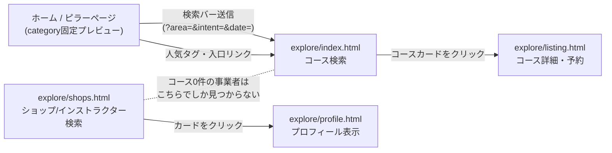

# 検索機能ガイド — Freediving Japan

> 最終更新：2026-07-14
> **対象読者**：このプロジェクトの検索まわりを初めて触る人。技術的な経緯は[DECISIONS.md](./DECISIONS.md)、DBの正式なスキーマ定義は[DB_SCHEMA_DESIGN.md](./DB_SCHEMA_DESIGN.md)、探すページの実装詳細は[EXPLORE_DESIGN.md](./EXPLORE_DESIGN.md)を参照。本書はそれらを読む前に「そもそも検索がどう成り立っているか」の全体像を掴むための入門ドキュメント。

-----

## 1. まず結論：「検索」は1つではない

このサイトには見た目も裏側のデータも違う**3種類の検索**がある。混同するとハマるので最初に区別する。

| # | 画面 | 何を探す | データの単位 |
|---|---|---|---|
| ① | ホーム／ピラーページ（`index.html`・`snorkeling.html`・`skindiving.html`・`freediving.html`） | 「シュノーケルの人気コース」のようなプレビュー一覧 | `listings`（コース）を`category`で絞ったもの |
| ② | 探す＝コース検索（`explore/index.html`） | 個々の体験・コース・プラン | `listings`（コース）1件＝1商品 |
| ③ | 探す＝ショップ/インストラクター検索（`explore/shops.html`） | 事業者そのもの（コースが0件でもヒットする） | `shops`/`instructors`（プロフィール）1件＝1事業者 |

①→②→③の順に「粒度」が粗い方から細かい方、あるいは「商品」から「人・お店」に軸が変わっていくイメージ。①と②は同じ`listings`テーブルを見ているが、①は`category`（ダイビング種別）で機械的に切っただけの固定プレビュー、②はユーザーが条件を組み合わせて絞り込む本番の検索画面、という役割分担。

-----

## 2. データの持ち方：検索の「軸」は4本ある

検索を理解する上で一番大事なのは、**「何で絞り込めるか」が2つのテーブル×2軸ずつ、計4本用意されている**ということ。

### 2-1. コース（`listings`）の2軸

| 軸 | カラム | 性質 | 値 |
|---|---|---|---|
| ダイビング種別 | `category` | 必須・4択・機械的な分類 | シュノーケリング／スキンダイビング／フリーダイビング／その他 |
| 目的（何がしたいか） | `intent` | 種別ごとに選べる範囲が制限される | やってみたい(try)／ちゃんと学びたい(learn)／ファンダイブ(fundive)／トレーニング(training)／コーチング(coaching) |
| 都道府県 | `prefecture` | 必須寄り・47都道府県＋「海外」のCHECK制約・**検索の正データ** | 東京都、沖縄県、海外 など |
| 人気スポット | `area` | 任意・補助的なタグ | 石垣島、伊豆、慶良間諸島 など14種＋実データ |

`category`と`intent`は独立した2軸で、`pro/index.html`の`INTENT_BY_CATEGORY`マップで「シュノーケリングはtryのみ」「フリーダイビングは全部選べる」のように選べる目的の範囲が制限される（DB側に制約はない。UI側だけのルール）。

`prefecture`と`area`は「粒度違いの場所情報」。都道府県だけで全国・海外を必ずカバーできる正データ、人気スポットは「石垣島」のような都道府県より細かい観光的なタグで任意入力。**都道府県フィルタだけで検索は必ず機能する**ように設計されていて、人気スポットは無くても困らない補助情報という位置づけ。

### 2-2. 事業者（`shops`／`instructors`）の2軸

| 軸 | カラム | 性質 | 値 |
|---|---|---|---|
| 都道府県 | `prefecture` | 任意・**2026-07-14〜検索の正データ** | 47都道府県＋「海外」 |
| 活動エリア | `areas` | 任意・自由入力の配列・季節ラベル付き | `["沖縄（4月〜10月）", "奄美大島（11月〜2月）"]` のような形 |

こちらも考え方は`listings`と同じ「都道府県＝正データ／自由入力タグ＝補助」だが、`listings.prefecture`（2026-07-05〜）より遅れて2026-07-14に同じ設計へ揃えたため、**古いデータには`prefecture`が空（NULL）のままの事業者が残っている可能性がある**（バックフィルSQLで既存データはある程度自動推定済み。詳細は[DECISIONS.md](./DECISIONS.md#2026-07-14exploreshopshtmlのエリア軸を都道府県に統一旧svg地図を撤去)参照）。

### 2-3. なぜ2つのテーブルに分かれているか

「コース検索（`listings`）」と「事業者検索（`shops`/`instructors`）」が別テーブル・別画面になっているのは、**事業者はコースを1件も出していなくても検索されたい**というニーズがあるため。たとえばショップを登録したばかりでまだコースを公開していない場合、`explore/index.html`（コース単位の検索）では絶対にヒットしない。そのための専用ページが`explore/shops.html`。

-----

## 3. 事業者登録（`pro/index.html`）とのつながり

検索に出てくるデータは、すべて事業者（インストラクター／ショップ）が`pro/index.html`で入力したものがそのまま検索の材料になる。「プロフィール」と「コース」で入力する場所も検索での使われ方も違うので分けて理解する。

### 3-1. プロフィール登録 → `explore/shops.html`に反映

`pro/index.html`の「プロフィール」タブで入力する内容：

- 氏名／屋号・自己紹介（日本語・英語）
- **拠点の都道府県**（`p-prefecture`/`sp-prefecture`という`<select>`。2026-07-14追加）→ `instructors.prefecture` / `shops.prefecture`に保存
- エリアと活動時期（自由入力＋季節ラベル、「＋エリアを追加」ボタンで複数行）→ `instructors.areas` / `shops.areas`に保存
- 資格・専門・対応言語・カバー画像 など

保存すると`explore/shops.html`の都道府県チップ・カード上の地名表示に即反映される。

### 3-2. コース登録 → `explore/index.html`に反映

`pro/index.html`の「コース管理」タブで1コースずつ入力する内容：

- タイトル・説明・価格・定員・所要時間 など
- **ダイビング種別**（`l-category`）と**検索タブ分類＝目的**（`l-intent`。種別に応じて選択肢が絞られる）
- **都道府県**（`l-pref`。47都道府県＋「海外」の`<select>`、必須寄り）→ `listings.prefecture`
- **人気スポット**（`l-area`。任意）→ `listings.area`
- タグ（当日予約OK・初心者OK など、`explore/index.html`の「こだわり条件」チップと連動）

公開（`is_public = true`）すると、該当する`category`のホーム／ピラーページのプレビューと、`explore/index.html`の全件一覧の両方に同時に現れる。同じ1件のデータが2つの画面に出る、という関係。

### 3-3. 対応表：どこに入力するとどこに出るか

| 入力画面 | 保存先 | 反映される画面 |
|---|---|---|
| `pro/index.html`プロフィール（都道府県） | `instructors.prefecture` / `shops.prefecture` | `explore/shops.html`の都道府県チップ・絞り込み |
| `pro/index.html`プロフィール（活動エリア） | `instructors.areas` / `shops.areas` | プロフィールページ（`explore/profile.html`）の表示のみ。検索の絞り込みには使われない（2026-07-14〜） |
| `pro/index.html`コース管理（種別・都道府県・人気スポット） | `listings.category` / `prefecture` / `area` | ホーム・ピラーページのプレビュー、`explore/index.html`の一覧・絞り込み |
| `pro/index.html`コース管理（タグ） | `listings.tags` | `explore/index.html`「こだわり条件」チップ、ピラーページの人気タグチップ |

-----

## 4. 画面ごとの構成

### 4-1. ホーム（`index.html`）／ピラーページ

- シュノーケル／スキンダイビング／フリーダイビングの3分類（`category`固定）でタブまたは専用ページに分かれる
- 各分類ごとに`listings`を`category`で絞ったプレビューカードを表示（`freediving.html`などが自前で`_sb.from('listings').eq('category', CATEGORY)`のようにクエリしている。`explore/index.html`を経由しない）
- 実際についているタグを集計した「人気タグチップ」を表示（固定リストではなく実データ由来）
- 検索バー（`form.searchbar`。`js/home.js`が送信を横取りして`explore/index.html`へ`?q=&area=&intent=&date=`付きで遷移させる）
- 「1日体験」「認定コース」などの入口チップは`explore/index.html?intent=try`のように直接`intent`を指定してコース検索へ渡す

### 4-2. 探す＝コース検索（`explore/index.html`）

- 検索バー：「エリア」（都道府県名・スポット名・スクール名のフリーテキスト。`js/area-picker.js`のドロップダウン候補付き）と「日程」（この日以降に空きがあるプランのみ表示）
- 都道府県チップ（`renderPrefChips()`が実データの件数を見て動的生成。人気都道府県は0件でも薄く常時表示）
- 「こだわり条件」折りたたみパネル：タグチップ＋価格帯チップ
- 並び替え（おすすめ順／価格安い順／価格高い順／評価順）
- 一覧カードは`category`のラベルと`intent`のバッジ（体験／資格／ファンダイブ／トレーニング／コーチング）を両方表示するが、**画面上に`intent`を切り替えるタブ自体は無い**。`intent`で絞り込みたい場合は外部（ホーム／ピラーページの「1日体験」「認定コース」入口チップ）からURLパラメータ（`?intent=`）で渡ってくる経路のみで、絞り込み中は「解除できるヒント」（`intentHint`）が表示される（2026-07-14修正。詳細は次節）

### 4-3. 探す＝ショップ/インストラクター検索（`explore/shops.html`）

- 「ショップ」「インストラクター」のタブ切替（型ごとに初回だけ取得しキャッシュ）
- 都道府県チップ（`explore/index.html`と同じ`renderPrefChips()`方式に2026-07-14で統一）
- 名前・自己紹介のフリーテキスト検索
- 並び替え（おすすめ順／評価順）
- カードをクリックすると`explore/profile.html`（プロフィール専用ページ）へ遷移。コースの有無に関わらず必ず見られる

-----

## 5. 検索の旅：具体例で追ってみる

「沖縄でフリーダイビングの体験をしたい」というユーザーが辿る一本の流れ：

1. ホーム(`index.html`)のフリーダイビングタブを開く → `category='フリーダイビング'`のプレビューが並ぶ
2. 検索バーに「沖縄」と入力して検索 → `js/home.js`が`explore/index.html?q=沖縄&area=沖縄`のようなURLへ遷移
3. `explore/index.html`の`applyUrlParams()`が`area`パラメータを見る → 「沖縄」が47都道府県リストに完全一致するので都道府県チップの絞り込みとして扱われる（一致しない地名なら自由テキスト検索に回る）
4. `loadListings()`が`listings`テーブルを`is_public=true`で全件取得 → `prefecture==='沖縄県'`または表記ゆれがあれば自由テキストにフォールバックしつつ絞り込み
5. 該当コースのカードをクリック → `explore/listing.html?id=...&listing=...`へ。ここで初めて予約カレンダー・料金など「1商品」の詳細を見る

一方「まだコースを出していないけど沖縄の新しいショップを探したい」場合は、上記2〜5とは別に`explore/shops.html`で都道府県チップ「沖縄県」を選ぶ、という完全に独立したルートになる。

-----

## 6. これまでの変遷（要点だけ）

検索の実装は複数回作り直されている。詳しい経緯は[DECISIONS.md](./DECISIONS.md)に日付順で残っているが、要点だけ：

1. **〜2026-07-05**：`listings`の場所情報は「エリア」14種の固定タグ（`area`）のみ。リストにない地名（鹿児島など）が検索から漏れる問題があった
2. **2026-07-05**：`listings.prefecture`（47都道府県＋海外・CHECK制約）を新設し検索の正データに格上げ。`area`は補助タグに格下げ
3. **2026-07-08**：Google Maps依存を廃止し、自前SVG日本地図（`js/area-map.js`）を`explore/index.html`・`explore/shops.html`両方に導入
4. **2026-07-10**：`explore/index.html`はSVG地図をやめ、都道府県チップ（`renderPrefChips()`）に統一。`shops.html`は`shops`/`instructors`に`prefecture`データが無く未対応のまま据え置き
5. **2026-07-14**：`shops`/`instructors`にも`prefecture`入力欄を追加しバックフィル、`shops.html`も都道府県チップに統一。旧SVG地図（`js/area-map.js`）はどのページからも使われなくなった

-----

## 7. 既知の制限・注意点

- **`explore/index.html`に`intent`を切り替えるUIが存在しない**：ホーム／ピラーページの「1日体験」「認定コース」チップが`?intent=try`のようなURLパラメータで`explore/index.html`に渡すが、受け側の画面自体にはタブなどの切り替えUIが無く、絞り込み中は解除ボタン付きのヒント文（`intentHint`）が出るのみ。
- **✅ 2026-07-14修正済み**：上記の`?intent=`受け渡しを実装する`applyIntent()`関数が実際には定義されておらず、「1日体験」「認定コース」チップを踏むと`ReferenceError`で一覧読み込み自体が止まっていた不具合を修正（`currentIntent`変数の新設・フィルタへの反映・ヒント表示・受け入れ値リストの現行taxonomyへの追随）。詳細は[DECISIONS.md](./DECISIONS.md#2026-07-14exploreindexhtmlのapplyintent未定義バグを修正)参照。2026-07-14 Chrome MCPで実機確認済み。
- **`shops.areas`/`instructors.areas`は検索に使われない**：2026-07-14以降、都道府県チップは`prefecture`のみを見る。自由入力の「活動エリア」はプロフィールページの表示情報としてのみ残る。
- **`shops`/`instructors`の`prefecture`が空のままの事業者がいる可能性**：2026-07-14のバックフィルは`areas`列のテキストから正規表現的に推測しただけのベストエフォートで、マッチしない地名（「瀬戸内」など複数県にまたがるものは対象外）は空のまま。事業者本人が`pro/index.html`で設定するまで都道府県チップには出てこない。
- **`listings.area`と`shops/instructors.areas`は名前が似ているが別物**：前者はコース単位・14種の固定タグ寄り、後者は事業者単位・自由入力の季節ラベル付きテキスト。

-----

## 8. 参照ファイル一覧

| 種類 | パス |
|---|---|
| コース検索画面 | `explore/index.html` |
| ショップ/インストラクター検索画面 | `explore/shops.html` |
| コース詳細・予約 | `explore/listing.html` |
| プロフィール表示 | `explore/profile.html` |
| 事業者登録・コース登録 | `pro/index.html` |
| 都道府県・人気スポットの共通データ | `js/location-data.js` |
| 検索バーのエリア候補ドロップダウン | `js/area-picker.js` |
| ホーム／ピラーページ共通の検索バー送信処理 | `js/home.js` |
| 決定経緯ログ | `docs/DECISIONS.md` |
| DBスキーマ定義 | `docs/DB_SCHEMA_DESIGN.md` |
| 探すページの詳細設計 | `docs/EXPLORE_DESIGN.md` |
